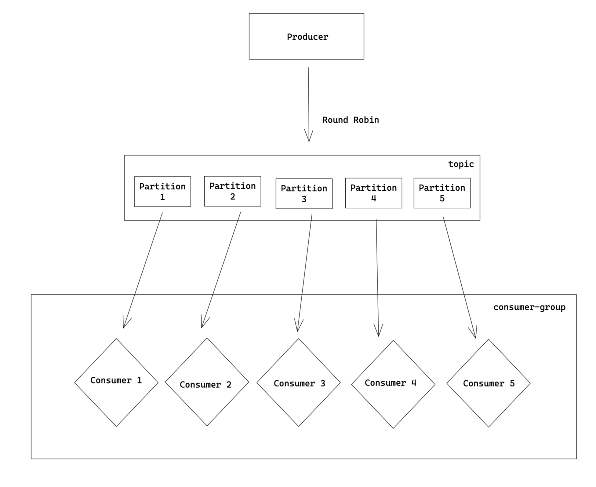

# How to run

1. Start kafka broker
```
$ make start-broker
```

2. Setup broker (topic creation)
```
$ make setup-broker
```

3. Start consumers 
```
$ make start-consumers
```

4. Produce messages 
```
$ make produce-one

OR 
 
$ make produce-forever
```

